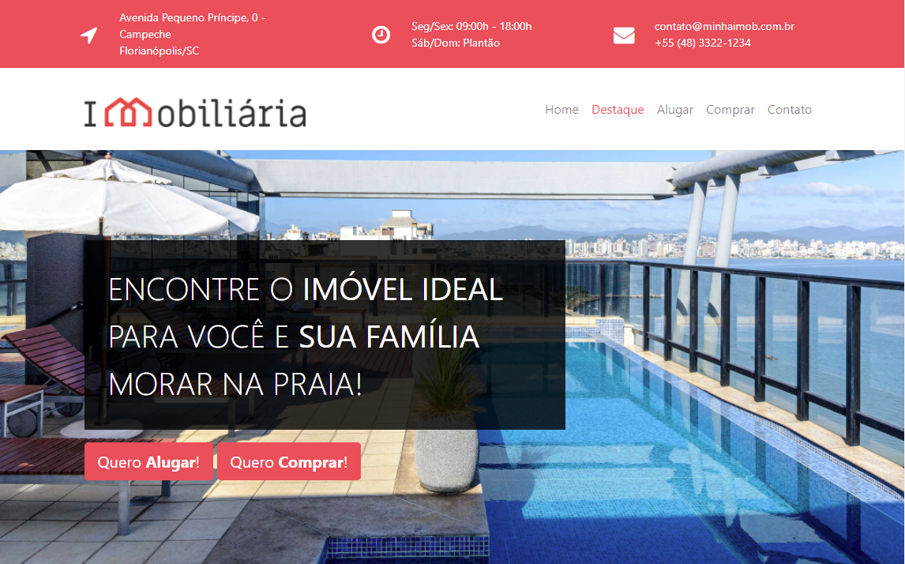
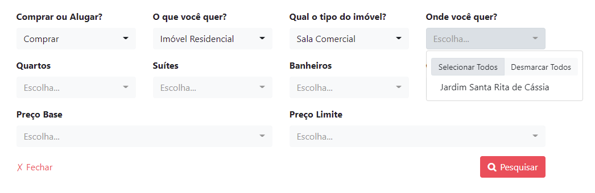
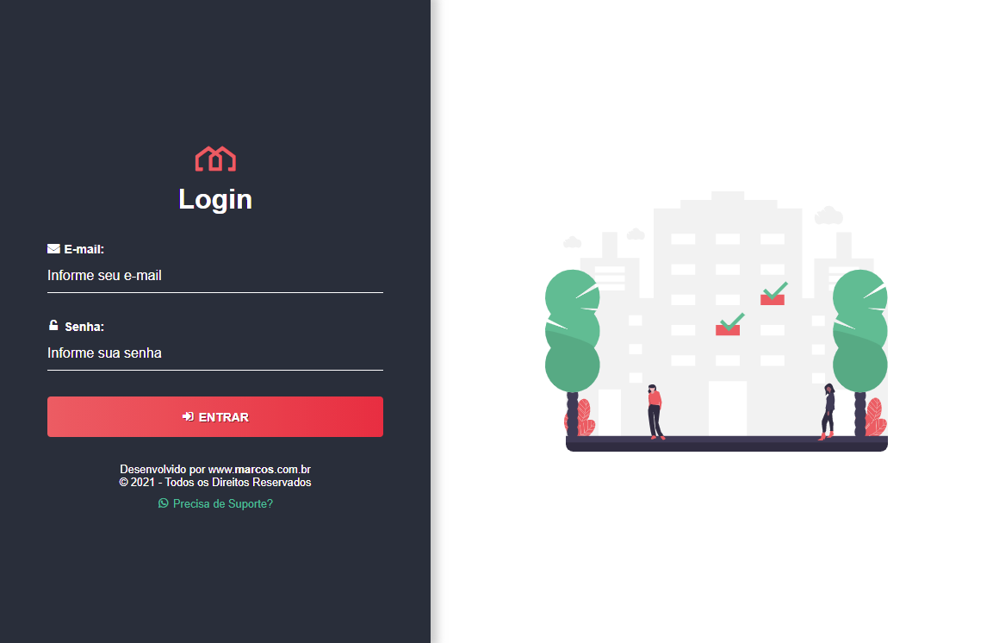
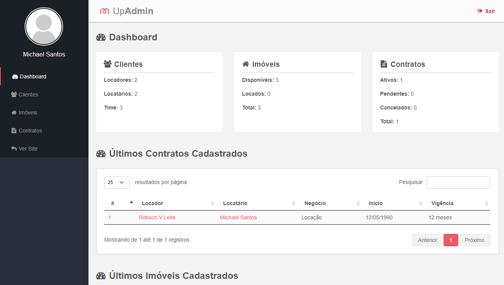

## Sistema imobiliário
Criado em laravel 8, o projeto do sistema foi feito em dois ambientes o web e o admin, ou seja, o web onde o usuário qualquer tem acesso, e o admin, onde temos uma dashboard para controle de contratos, imóveis e clientes.
No front foi utilizado a template engine nativa do laravel, o Blade. Foi inserido também diversos gatilhos em ajax para evitar o carregamento da página.

## Visão da Home

## Visão do filtro construído em ajax

## Tela de login para a administração

## Amostra da dashboard
